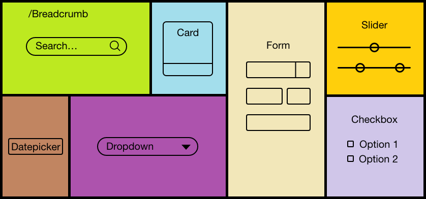

# react-layoutç# react-layout 
Bootstrap-React layout project



## Installation
Project created with 
1. Create React App (CRA)
```npx create-react-app react-layout```
- Required: Node.js, Yarn

## Dependencies
2. Bootstrap React Bootstrap 
```yarn add bootstrap react-bootstrap```